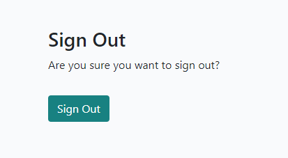

# El Madre - A Personal Blog

Visit the live site [here](https://el-madre-82f96d334383.herokuapp.com/).

This is a blog about the real-life adventures of El Madre. El Madre is a persona on the internet who shares episodes of her life in a fun way!

## Table of Contents

1. [Design](#design)
2. [Features](#features)
3. [UX](#ux)
4. [Testing](#testing)
5. [Sources](#sources)
6. [Credits](#credits)

## Design

The site was created with persons in mind who are looking for some light entertainment. The aim was to evoke feelings of joy and lightness through bright and happy colors and fonts. Besides that, the design is kept rather simple and minimal as to not distract the user from reading the content and navigating the page.

### Wireframes

The wireframes were made in Balsamiq, and show different pages of the blog on different devices. The wireframes were kept very simple and the focus was on structure rather than design. In the implementation stage, the signup and login pages changed slightly from the wireframes due to remaining with the default built-in designs. The "Categories" and "Favourites" navigation elements were added in line with the functionality of the blog.

- Homepage 
  

- A post in detail 
  

- Comment section 
  

- Sign Up 
  

- Login 
  

### Font and Colour Choices
**Fonts:** 'Roboto' and 'Lato' were chosen as they are quite neutral, easy-to-read but still friendly fonts. This allows the reader to focus on the content.

**Colours:** The color palette was found by searching for "happy colors" on [color-hex.com](https://www.color-hex.com/). The idea was to have a very bright, airy and light feel to the blog so as to convey happiness and a break from everyday life. A rainbow of pastelly colors evokes a feeling of fun. The colors taken from the color palette were sometimes copied identically, and sometimes made a few shades darker or brighter depending on what the blog needed. In all of this, the question of accessability/contrast and ease with which to read was kept in mind.

 

**Images:** The default placeholder image was chosen for its color palette which also has a mostly bright, white-ish background, with pops of fun pastel colors. All images were taken from [pexels.com](https://www.pexels.com/). Credit details in the [Credits](#credits) section.

- Default placeholder image 

## Features

The below section describes the site's features in detail.

- **Header**
    - The header is always visible on all pages of the blog. The brand logo is a link to the home page.
    - On the right-hand side, there is a tag-line of what the blog is about.
    - Depending on whether a user is logged in or not, the elements in the navigation bar change.
    - A logged out user sees navigation elements to Home, Register and Login.  
    
    - A logged in user sees navigation elements to Home, Categories, Favourites and Logout.  
    

- **Main section - Home page**
    - The main part of the homepage contains a display of the three most recent blog posts. 
    - Each post is displayed with an image, the post's title and the first 20 words of the post's content.
    - The image is either one chosen and uploaded by the writer of the post, or - if none was chosen - a default image.
    - A little banner shows the reader who the author of the post is, and what category it belongs to. This hints at additional functionality being available to logged in users.
    - In the upper right-hand corner a small text informs the reader which user is logged in. If no user is logged in, the text reads "You are not logged in".
    - Should more than three posts exist, there is a "Next" button at the bottom of the page. Should the user click on the "Next" button, a "Prev" button appears to its left so the user can choose to navigate back to the previous page. 
     

- **Register**
    - Should a site visitor wish to enjoy extra functionality such as being able to comment, favourite posts or choose a certain category of posts, the user needs to register.
    - Registering is done via its own page which asks the user to choose a username and a password. Providing an email address is optional. In order to ensure password safety, some guidelines for choosing a good password are displayed. 
     

- **Sign in**
    - Should a user already have an account, they can log in via the sign in page. 
    - If they have visited the site before, and asked to be remembered, their user details will be pre-filled.
    - Should a user not yet have an account, they are redirected to the register page. 
     

- **Post detail - Top of the page**
    - Upon clicking on any post title, a new page opens up.
    - The post title, category and date of publishing are displayed at the top next to the post's image.
    - Right below, a button is displayed. If a post is not yet part of a user's favourites, the button reads "Add to Favourites". Upon clicking it, the post is added to the user's favourites.
    - If a post is already part of a user's favourites, the button reads "Remove from Favourites". Upon clicking it, the post is removed from the user's favourites.
    - In the mobile view, the post's image is not displayed when looking at a post in detail. 
     
     
     

- **Post detail - Comment section incl. CRUD**
    - At the end of the blog post, a comment section is shown.
    - The logged out user can read comments made by other users but cannot comment themselves. A prompt informs them to log in should they wish to comment.
    - A little icon and comment counter visually informs the user of the number of published comments a post has.
    - The logged in user can also read comments, and in addition can leave comments and edit or delete their own:
        - CREATE: A logged in user can leave a comment by inserting their text and clicking on the Submit button. The comment is then immediately published and for everyone to see.
        - READ: Any user can read their and other users' comments. Should the admin decide to revoke a comment's approval, the comment is shown as greyed out to the user who wrote it. The comment is not visible to any other users anymore.
        - UPDATE: The user who wrote a comment can edit their comment - regardless of whether it is in an approved state or not.
        - DELETE: The user who wrote a comment can choose to delete it. As this action cannot be undone, an additional action by the user is needed to delete a comment. 
     
     
     
     

- **Categories**
    - Upon clicking on "Categories" in the navbar, a dropdown field with all available categories opens up.
    - Once a category is chosen, all posts belonging to this category are displayed to the user.
    - For good UX, the way the posts are displayed is the same as on the homepage and the Favourites page. 
     
     

- **Favourites**
    - Upon clicking on "Favourites" in the navbar, a new page opens up.
    - All posts which have been added by the user to their favourites are displayed to the user.
    - For good UX, the way the posts are displayed is the same as on the homepage and the Categories page. 
     

- **Sign Out and User Feedback**
    - Upon clicking "Signout" in the navbar, the user is redirected to a sign out page.
    - On this page, the user is asked whether they really want to sign out, in order to ensure this is the user's intention.
    - Upon confirming, the user is signed out.
    - To ensure good UX, a feedback message is displayed to the user, informing them that their action was successful.
    - These kind of success/error messages are implemented throughout the page, such as when a user adds a post to their favourites, removes a post from their favourites, or comments. 
     
     

- **Footer**
    - The footer contains a copyright symbol and the author's, ie my, name.
    - There are facebook, YouTube and Instagram icons. The icons open in a new tab, making it easy for users to come back to the site.
    - The footer is consistent throughout the pages.
    

### Possible Future Features

- About Me Page

    - In order to provide the interested user with more information, an about page could be implemented telling the site visitor more about who El Madre is.

- 404 Error Page

    - A customized 404 error page could enhance UX even further by providing a meaningful feedback message on what has gone wrong.

- More complex commenting/approval functionality

    - Currently, a user's comment is immediately displayed on the site. The admin has the possibility to revoke approval. Once the approval is revoked, the comment still shows for the user who wrote it, but not for anybody else. Also, the user who wrote the un-approved comment still has CRUD functionality, ie can edit and/or delete the comment. If a user edits a previously un-approved comment, then the comment is - in the current project - immediately displayed again. This is considered acceptable since it gives the user the possibility to rectify any potential mistakes they made in the comment (such as violating community guidelines). However in the future, it could be a feature to turn around the logic for comments that were previously un-approved. Meaning, in such a case, the admin would then have to approve the edited comment, before it would be displayed again. 

## UX

### Site Goals

The site wants to motivate users to read blog posts about the exciting life of El Madre. The site wants to evoke a happy atmosphere and good feelings.
The goal is for the user to get a sense of ownership of their own space on the blog which they access by logging in. The additional functionality they can enjoy, such as commenting, choosing from categories or managing favourites, allows for some personalization of the blog.
For the admin, the site wants to make it easy to publish new and manage existing blog posts, and have authority over comments and categories.

### User Stories

There are two types of users on the El Madre blog: site visitors/users, and the site admin. The site was made with these two user groups in mind.

**As a site visitor:**

- As a site user I can register an account so that I can benefit from additional functionality such as commenting.
- As a site user I can view a paginated list of posts so that I have a good overview and can choose which post to view in detail.
- As a site user I can view a post in full so that I can read its contents.
- As a logged in site user I can comment on posts so that I can share my view on a given blog post.
- As a logged in site user I can choose a category of blog posts so that I see those posts which correspond to the topic I am interested in.
- As a logged in site user I can favourite individual posts so that I can retrieve them with ease.

**As the site administrator:**

- As a site admin I can create, read, update and delete posts so that I can manage the blog content.
- As a site admin I can publish several draft posts at once so that I can be efficient in my role.
- As a site admin I can un-approve comments so that quality and appropriate content on the blog is ensured.
- As a site admin I can select a category for my posts so that posts can be grouped according to topic.

### ERDs

In order to fulfill the user stories, the ERDs were drawn up to allow all needed functionality.
Please note that the post model also contains a variable "featured_image" which takes the value of "CloudinaryField". Unfortunately, I could not figure out how to insert this value in DrawSQL, which the ERD was created in. So it is added on the screenshot. 

## Testing
A comprehensive report on testing done for this project can be found [here](Testing.md).

## Deployment

The repository was created on GitHub.

The code was edited in GitPod.
- Changes in the course of the coding, as well as the final code and readme, were done in GitPod and then pushed to GitHub using the sequence: "git add ." --> "git commit -m "..."" --> "git push"

This site was then deployed on Heroku:
- In Heroku, on my dashboard, I clicked "New" and then "Create new app"
- I named the app and set the region to "Europe", clicked "Create app"
- In the settings tab, I added the necessary Config Vars "CLOUDINARY_URL", "DATABASE_URL", and "SECRET_KEY" and the respective values, and clicked "Add"
- In the deploy tab, selected "GitHub" as deployment method. Searched for my project and connected the app to it.
- Deployed by choosing "Manual deploy".

## Technologies/Packages Used and Sources

- Main programming languages: Python, HTML, CSS, and JavaScript
- Django v4.2.1 (version 4 since it is a long-term supported (LTS) release)
- Django Template Tags and Filters for learning about [truncate](https://www.djangotemplatetagsandfilters.com/filters/truncatewords/)
- Gunicorn v20.1
- PostgreSQL / [ElephantSQL](https://elephantsql.com)
- Dj-database-url v0.5
- Psycopg2 v2.9
- [Random key generator](https://randomkeygen.com/)
- Summernote v0.8.20.0
- Bootstrap v5.0.1
- Google Fonts
- Font Awesome
- Whitenoise v5.3.0
- Django Allauth v0.57.0
- Django Crispy Forms v2.0
- Crispy Bootstrap5 v0.7
- Cloudinary v1.36.0
- Dj3 Cloudinary Storage v0.0.6
- Urllib3 v1.26.15

## Credits
- User indigo7220 for the "happy colors Color Palette" made available on [color-hex.com](https://www.color-hex.com/color-palette/7779)
- [Favicon.io](https://favicon.io/favicon-generator/) for generating a Favicon
- [Very Academy](https://www.youtube.com/playlist?list=PLOLrQ9Pn6cawWd-5UZM6CIm0uqFXeBcTd) for their tutorial series on how to build a simple blog in Django
- [Bootstrap Documentation for creating dropdown buttons](https://getbootstrap.com/docs/5.0/components/dropdowns/)
- [Balsamiq](https://balsamiq.com/wireframes/?gad_source=1&gclid=CjwKCAiAk9itBhASEiwA1my_69kk20n5mqra-HeVpfNmeSClto_fGlIiPCKzduzzLOWiWZe6Il1yXxoCHCsQAvD_BwE) for the wireframes
- [DrawSQL](https://drawsql.app/?via=tai&gclid=CjwKCAiAtt2tBhBDEiwALZuhAFLAmFOxB2XO3NkC-2Zz3Pi1AX4lX-9Ybx_iJxwUXvUOJjO8U7xTpRoCb64QAvD_BwE) for making the ERDs
- Default photo by Jess Bailey Designs on [pexels.com](https://www.pexels.com/photo/two-brown-pencils-on-white-surface-965117/)
- Photo by Anurag Sharma on [pexels.com](https://www.pexels.com/photo/photo-of-four-people-showing-painted-hands-2728252/)
- Photo by Steve Johnson on [pexels.com](https://www.pexels.com/photo/orange-yellow-green-and-blue-abstract-painting-1704120/)
- Photo by Jeswin Thomas on [pexels.com](https://www.pexels.com/photo/mosque-1007426/)
- Photo by Studio Art Smile on [pexels.com](https://www.pexels.com/photo/horizontally-striped-flag-3476860/)
- Photo by Christina Morillo on [pexels.com](https://www.pexels.com/photo/woman-programming-on-a-notebook-1181359/=)
- Photo by Carlie Wright on [pexels.com](https://www.pexels.com/photo/kiwi-fruits-cut-in-half-laying-on-pink-surface-with-green-curtain-in-background-10562640/)
- [ChatGPT](https://chat.openai.com/) wrote the content of the blog posts for me
- [Code Institute's](https://codeinstitute.net/global/full-stack-software-development-diploma/?utm_term=code%20institute&utm_campaign=CI+-+AT+-+Search+-+Brand&utm_source=adwords&utm_medium=ppc&hsa_acc=8983321581&hsa_cam=18265909565&hsa_grp=142347245433&hsa_ad=646574752722&hsa_src=g&hsa_tgt=aud-1599270334980:kwd-319867646331&hsa_kw=code%20institute&hsa_mt=e&hsa_net=adwords&hsa_ver=3&gad_source=1&gclid=Cj0KCQiA2eKtBhDcARIsAEGTG43ORz1h13a2KLlWQpx9pKe36fyJK4x8Gq7OpjnnPzgt_NBkrarutvMaAnHkEALw_wcB) walkthrough project "I think therefore I blog" for the inspiration of a basic structure of a blog
- My group facilitator Kay Welfare for providing guidance and directing me to focus on the relevant parts all while encouraging me to deliver a good project
- My Mentor Spencer Barriball for his input and making himself available for questions
- Myself for putting in the work and effort and spending hours upon hours on fixing "little" bugs