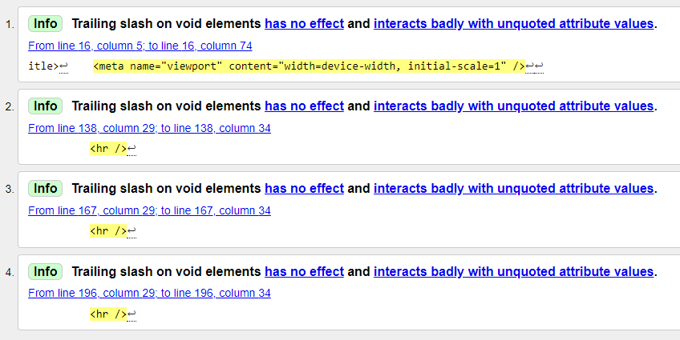
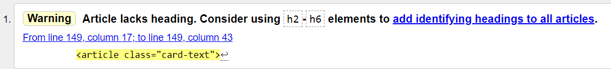
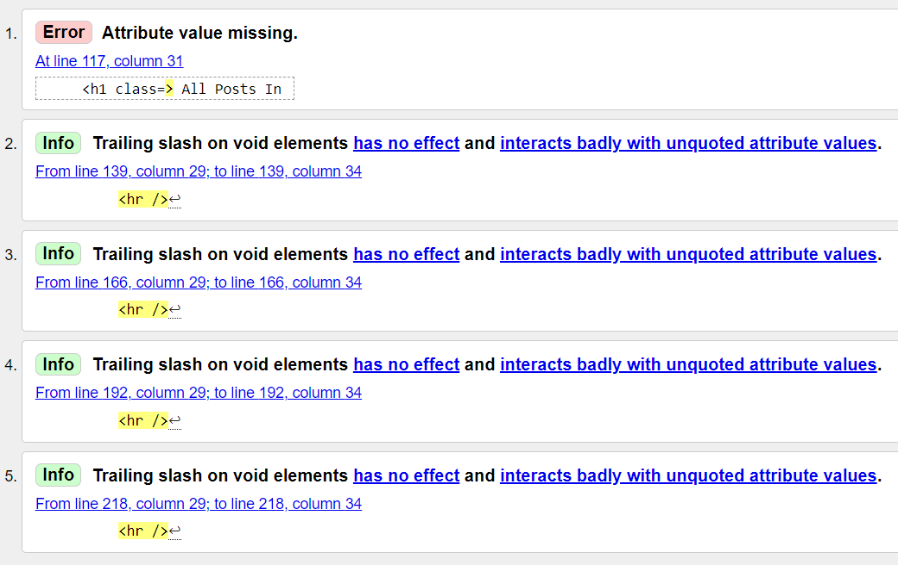
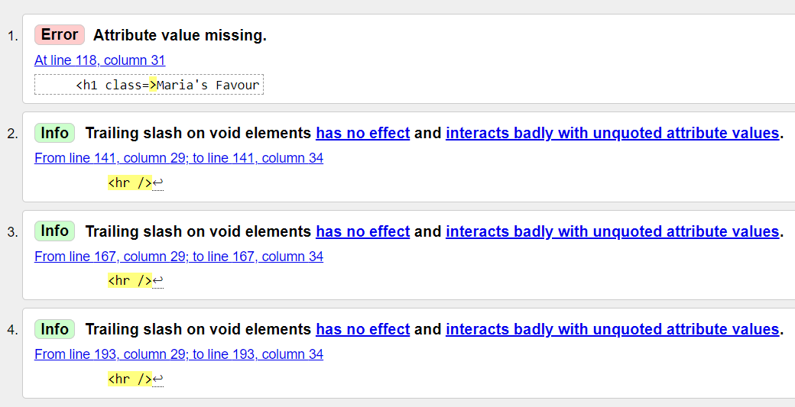
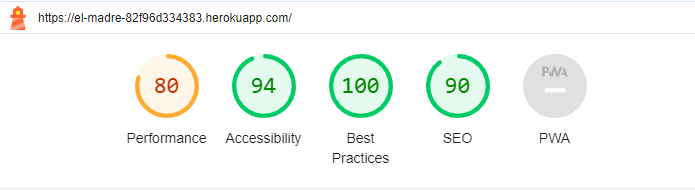
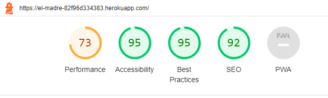

## Testing

- I confirmed that this project is responsive and looks good on various common screen sizes by using the devtools devices toolbar.
- I confirmed that there is validation when signing up as a new user, ie username and/or password cannot be left empty.
- I checked that the user is informed about their login status ("You are not logged in" / "You are logged in as [ user ]").
- I confirmed that the user receives meaningful feedback messages on their actions, such as "You have signed out" or "Successfully signed in as [ user ]".
- I made sure that only logged in users can choose from Categories or add / remove Favourites.
- I checked that on signing out, a second layer of confirmation is needed to ensure no accidental sign-out.
- I ensured that the brand logo acts as a link back to the homepage.
- I confirmed that header and footer are easily readable and understandable.

### Fixed Bugs

- When creating my categories, the site did not display correctly when appending /category/one-of-my-categories to the url even though the url was constructed correctly. The solution was that in the class CatListView(ListView), the variable template_name was incorrectly set to 'category.html', while the correct path was template_name = 'blog/category.html'.
- When creating my categories-dropdown in the navbar, the categories did not display. The reason was that I had used data-toggle="dropdown", which came from older Bootstrap versions. Fixed by changing to data-bs-toggle="dropdown", which is the correct attribute under Bootstrap 5.
- There were underscores between the icons in the footer. Fixed by removing whitespaces between the Font Awesome icons and their anchor tags.
- When a logged in user clicked on "Add to favourites" on a post which they had previously already favourited, then the post was removed from the user's favourites. Fixed by changing the content of the button so a user would know that clicking the button again would result in "Remove from Favourites".
- On mobile view, if the blog post title was too long, the Add to/Remove from Favourites button was not or only partly visible. Solved by adding a media-query adjusting the masthead-height to auto in style.css.
- On tablets, when looking at posts in detail, the image was sometimes shorter in height than the title. Resolved by restricting the title length to max. 50 characters in the model.
- On smaller screens, the images were too high. Fixed by adding a media query.
- Lighthouse report punished my Best Practices score for the aspect ratios of the images being off. Fixed by adding code in css to cover the image's container and center the image.
- Lighthouse report punished my Best Practices score for the cloudinary images loading via HTTP and not HTTPS. Fixed - after spending lots of time - by adding a cloudinary config code to settings.py and setting "secure=True".

### Unfixed Bugs

- None.

### Validator Testing

Please note I only tested code which was written or modified by me. I did not test code that came pre-installed or as templates with packages, such as login.html, logout.html, etc. or tests.py etc.

- HTML ([W3C Validator](https://validator.w3.org/))
    - **base.html and index.html:** 
     
    - Solution: removed trailing slashes. --> NO ERRORS

    - **post-detail.html:** 
     
    - Solution: added an h6-element and set display to none. --> NO ERRORS
    
    - **category.html:** 
     
    - Solution: removed "class=" and trailing slashes. --> NO ERRORS

    - **favourites.html:** 
     
    - Solution: removed "class=" and trailing slashes. --> NO ERRORS

- CSS ([Jigsaw](https://jigsaw.w3.org/css-validator/))
    - No error found.

- JS ([JS Hint](https://jshint.com/))
    - 1 error found in comments.js: "One undefined variable: line 5 bootstrap".
    - Solution: Added /* global bootstrap */ comment at the top of the file. --> NO ERRORS

- Python ([CI PEP8 Python Linter](https://pep8ci.herokuapp.com/))
    - **blog/admin.py:** 
        - Errors: lines too long, too few lines after Classes, trailing whitespaces
        - Solution: broke up lines, added lines, removed whitespaces --> NO ERRORS

    - **blog/forms.py:** 
        - Errors: no errors found

    - **blog/models.py:** 
        - Errors: lines too long, missing line at the end, trailing whitespaces
        - Solution: broke up lines, added line, removed whitespaces --> NO ERRORS

    - **blog/urls.py:** 
        - Errors: indentations too short
        - Solution: added indentations --> NO ERRORS

    - **blog/views.py:** 
        - Errors: lines too long, missing line at the end, trailing whitespaces
        - Solution: broke up lines, added line, removed whitespaces --> NO ERRORS

    - **elmadre/settings.py:** 
        - Errors: lines too long, missing line at the end, trailing whitespaces, missing indentation
        - Solution: broke up lines, added line, removed whitespaces, added indentations --> NO ERRORS

    - **elmadre/urls.py:** 
        - Errors: one line containing only whitespaces
        - Solution: removed the line --> NO ERRORS

- Performance, Accessibility, Best Practices, SEO (Lighthouse Chrome Dev Tools)
    - Performance was mediocre in the Lighthouse test, with 80 on desktop and 73 on mobile. It was still considered acceptable.
    - The other parameters tested well.
    - For desktop: 
     
    - For mobile: 
     

### Browser Testing (section adapted from Kay Welfare, results are my own)

**Layout:** Testing layout and appearance of site for consistency throughout browsers.

**Functionality:** Ensuring all links, navigation, buttons and form submit functions work as expected throughout browsers.

| Browser     | Layout      | Functionality |
| :---------: | :----------:| :-----------: |
| Chrome      | ✔          | ✔             |
| Edge        | ✔          | ✔             |
| Firefox     | ✔          | ✔             |
| Safari*     | ✔          | ✔             |

*Only available to me on iPhone. My mentor kindly reviewed the site for me in Safari on desktop. 

### Manual Testing (section adapted from Kay Welfare, results are my own) - TBD

| Feature     | Expect      | Action        | Result |
| :---------: | :----------:| :-----------: | :-----:|
| **Brand link**   | When clicked, the user is taken back to the home page | Clicked on brand link  | Return to home page |
| **Register link**  | When clicked, the user is forwarded to a page where they can sign up  | Clicked on Register | Sign Up page appears |
| **Sign Up button** | When filling in a username and a password, and clicking on "Sign Up", an account is created  | Filled in a username and a password and clicked on "Sign Up" | New user is created |
| **Login link** | When entering a previously registered username and password, and clicking "Sign In", the user is signed in | Entered username and password, and clicked "Sign In" | User is signed in |
| **Meaningful feedback messages** | Upon taking an action, such as signing in, a feedback message is displayed to the user, which can be closed by clicking the little X | Signed in | Modal with feedback message about successful login opens; can be closed by clicking on the little X |
| **Navigating blog posts** | When clicking on a NEXT or PREV button on the home page, the next or previous page of blog posts appears | Clicked on the NEXT and PREV buttons |Next/Previous three blog posts appear |
| **Opening blog posts** | When clicking on a title, a blog post opens in full | Clicked on a blog post's title | Blog post opens in full |
| **Add to favourites** | Upon clicking on "Add to Favourites" a blog post is added to the user's favourites | Clicked "Add to Favourites" | Success message appears "Removed from your favourites!" |
| **Remove from favourites** | Upon clicking on "Remove from Favourites" a blog post is removed from the user's favourites | Clicked "Remove from Favourites" | Success message appears "Added to your favourites!" |
| **Favourites link** | When clicked, dropdown menu of all categories opens; upon choosing a category, all posts of this category are displayed | Clicked Categories link and then chose each category after the other | All posts belonging to the respective category were displayed |
| **Categories link** | When clicked, a page of all the user's favourite posts appears | Clicked Favourites link | All posts markes as Favourite by the user appear |
| **Leaving a comment - blank** | When clicking "Submit" without entering a comment, a prompt tells the user what to do | Clicked "Submit" without entering any content in the Body field | Prompt gets displayed: "Please fill out this field." |
| **Leaving a comment** | When entering content into the Body field and clicking "Submit", the comment gets displayed, and the comment count increases | Clicked "Submit" after entering content in the Body field | Feedback message appears: "Thank you for your comment!"; the comment appears below the blog post and the counter increases |
| **Editing a comment** | When clicking "Edit" below one of the user's own comments, the comment gets displayed in the Body field, and can be edited; after editing and clicking "Update", the edited comment is displayed below the blog post | Clicked "Edit", edited the comment, and clicked "Update" | The edited comment is displayed below the blog post and a success message displayed: "Comment Updated!" |
| **Deleting a comment** | When clicking "Delete" below one of the user's own comments, the comment gets deleted | Clicked "Delete" | A modal pops up asking the user to confirm that they want to delete the comment; clicked "Delete"; success message displays: "Comment deleted!" |
| **Logout link** | Upon clicking, the user is logged out | Clicked the Logout link | A confirmation question is displayed to the user whether they really want to log out; upon clicking "Sign Out", a success message is displayed: "You have signed out." |
| **Facebook/YouTube/Instagram icons in footer** | Upon clicking, the respective social media site will open in a new tab | Clicked all the icon | The respective site opens in new tab |

### Testing User Stories (section adapted from Kay Welfare, results are my own)

| Expectation                         | Result                          |
| :---------------------------------: | :------------------------------:|
| As a site user I can register an account so that I can benefit from additional functionality such as commenting. | As a visitor, I can see a Register link in the navbar which takes me to a registration site. Registration is straightforward and the registration form gives me helpful feedback prompts. |
| As a site user I can view a paginated list of posts so that I have a good overview and can choose which post to view in detail. | As a visitor, I see three posts displayed on the home page. It is easy to navigate to the next page should I wish to do so. By clicking on the title, I can read the full post. |
| As a site user I can view a post in full so that I can read its contents. | As a visitor, upon clicking on a post title, I can read the post in full. |
| As a logged in site user I can comment on posts so that I can share my view on a given blog post. | As a logged in visitor, I can comment on the posts of my choice. I can also edit and delete my comments. |
| As a logged in site user I can choose a category of blog posts so that I see those posts which correspond to the topic I am interested in. | As a logged in visitor, I can choose the category I am interested in from a dropdown menu in the navigation bar. Upon clicking on a category, all posts belonging to that category are displayed to me. |
| As a logged in site user I can favourite individual posts so that I can retrieve them with ease. | As a logged in visitor, I can add posts to my favourites by clicking the corresponding button in the detailed post view. I can remove a post from my favourites in the same way. Upon clicking on Favourites in the navbar, I see all posts I have favourited. |
| As a site admin I can create, read, update and delete posts so that I can manage the blog content. | As a site admin, I can create, read, update and delete posts from the admin panel by clicking on Posts. |
| As a site admin I can publish several draft posts at once so that I can be efficient in my role. | As a site admin, I can create several posts in draft mode and then choose to publish them all at once by selecting them and then choosing "Mark selected posts as published" in the dropdown menu. |
| As a site admin I can un-approve comments so that quality and appropriate content on the blog is ensured. | As a site admin, I can revoke approval of select comments by clicking on the comment and then un-ticking the Approval box |
| As a site admin I can select a category for my posts so that posts can be grouped according to topic. | As a site admin, I can select a category for my post by clicking on a dropdown menu. I can also create new categories by adding on under Categorys [ sic! ]. |